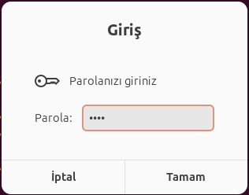

# Zenity ile Envanter Yönetim Sistemi

Bu proje, Zenity araçlarını kullanarak geliştirilmiş bir envanter yönetim sistemi betiğidir. Sistem, ürün ekleme, listeleme, güncelleme ve silme işlemleri gibi özelliklere sahip bir grafik arayüz sağlar.

## **Özellikler**

- Kullanıcı adı ve şifre ile giriş.
- Ürün ekleme, listeleme, güncelleme ve silme.
- Rapor alma özelliği.
- Kullanıcı yönetimi ve şifre sıfırlama.
- Yönetici ve kullanıcı rolleri arasında yetki farkı.
- Kritik işlemler için onay ekranları.
- Veri doğrulama ve hata kaydı.

## **Klasör Yapısı**

  ```
project_root/
├── scripts/
├── screenshots/
├── data/
└── README.md
```

## **Kurulum**

1. **Gerekli bağımlılıkları yükleyin:**
   ```bash
   sudo apt install zenity
   ```

2. **Proje dosyalarını indirin ve çalıştırın:**
   ```bash
   bash main.sh
   ```

## **Ekran Görüntüleri**

### 1. Giriş Ekranı: Kullanıcı Adı


### 2. Şifre Ekranı


### 3. Ana Menü


### 4. Ürün Ekleme   


### 5. Ürün Listeleme


### 6. Ürün Güncelleme


### 7. Ürün Silme


### 8. Rapor Alma


### 9. Kullanıcı Yönetimi


### 10. Şifre Sıfırlama


## Katkıda Bulunmak İsteyenler İçin

1. Projeyi kendi bilgisayarınıza indirin.
2. Geliştirmek istediğiniz özellikleri ekleyin veya mevcut hataları düzeltin.
3. Geliştirmelerinizi ana projeye dahil etmek için bir pull request gönderin.

## Lisans
----------
Bu proje MIT Lisansı ile lisanslanmıştır. Lisans detayları için `LICENSE` dosyasını inceleyebilirsiniz.
